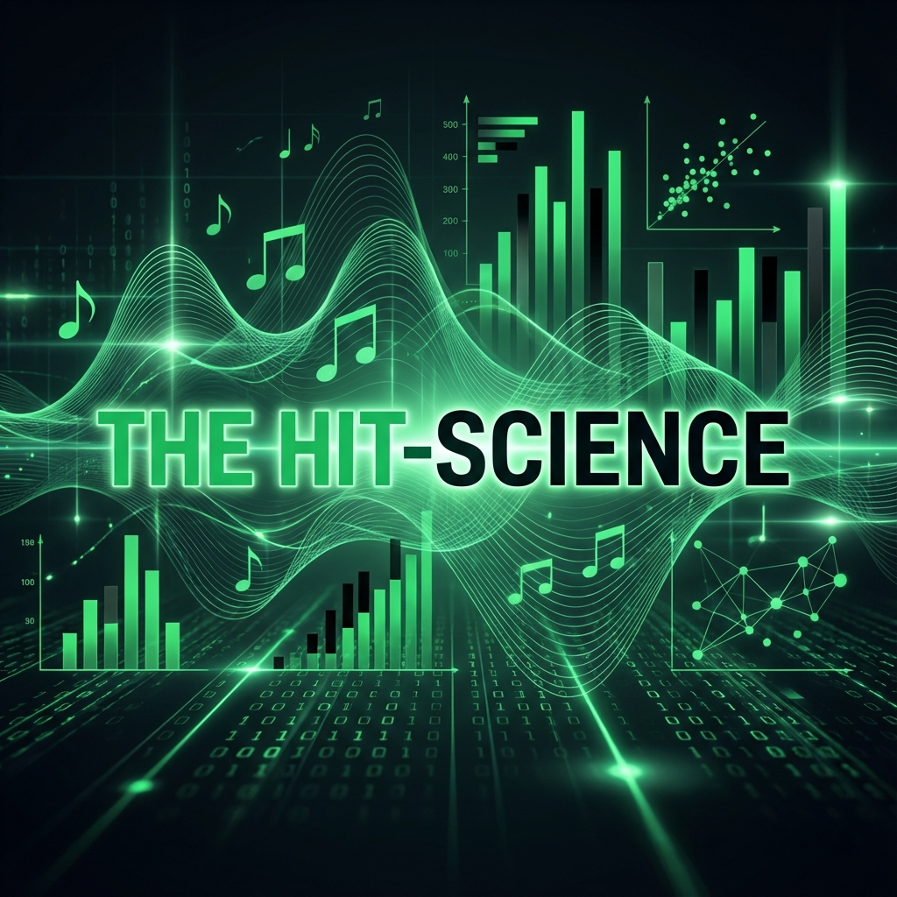
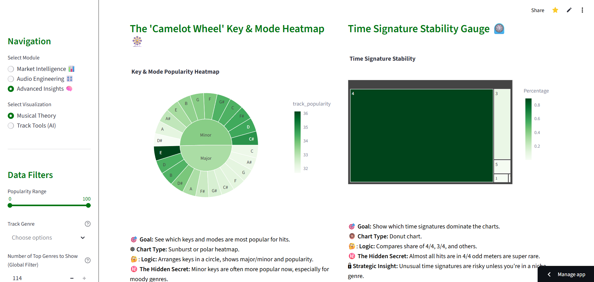

# 🎵 The Hit-Science: Decoding Spotify Popularity 🚀



## Dashboard Link: https://spotifyhitscience.streamlit.app/




## 📊 Project Overview

**"The Hit-Science"** is an advanced data analytics dashboard designed to reverse-engineer the formula of a successful music track. By analyzing specific audio features, metadata, and popularity metrics from Spotify's extensive library, this project provides actionable intelligence for Artists, Producers, and A&R (Artists and Repertoire) representatives.

This tool goes beyond basic descriptive statistics, employing **Machine Learning** algorithms to identify hidden patterns, cluster "hit-potential" songs, and quantify exactly how close a new track is to the current market standard of a "Hit".

## 🧐 The Business Problem

In the modern streaming era, 100,000+ songs are uploaded to Spotify every day. Cutting through the noise is harder than ever. Music professionals face critical questions:
- *Does being "loud" still guarantee more streams?*
- *Are shorter songs really performing better due to TikTok?*
- *What is the specific "Sonic DNA" (tempo, energy, valence) of a Top 100 hit?*

This dashboard provides data-driven answers to these questions, moving decision-making from "gut feeling" to **statistical evidence**.

## � API Integration & Data Pipeline

Unlike static analysis projects, this dashboard features a live data bridge:
- **Core Engine:** The `src/spotipy_api_extract_engine.py` script serves as the backbone for data enrichment.
- **Live Connection:** Integrates directly with the **Spotify Web API** using a custom-registered **Spotify for Developers App**.
- **Functionality:** Handles secure OAuth2 authentication to fetch granular metadata (such as precise release dates) that is often missing from standard CSV datasets, ensuring the "Time-Series" analysis is accurate to the day.

## 💡 Key Features & Modules
The application is structured into **Story Chapters** to guide the user through a data narative:

### 1. Market Intelligence 📊
*The "Big Picture" view of the music industry.*
- **Global Overview:** Histograms & KDE plots revealing the "Long Tail" nature of music consumption and Genre Market Share.
- **Artist Strategy:** Analyzing how artists build catalogs and the impact of Explicit content on success.

### 2. Audio Engineering 🧬
*Deep-dive into the technical "Sonic DNA" of a track.*
- **The "Hit" Formula:** Correlation matrices and Loudness regressions verifying if "louder is better".
- **Production Style:** A **Density Heatmap** comparing **Acousticness vs. Energy** to map the landscape of "Natural" vs. "Processed" sound.
- **Rhythm & Texture:** Analyzing Tempo distributions and Speechiness ranges.

### 3. Advanced Insights 🧠
*Predictive modeling and high-dimensional analysis.*
- **Musical Theory:** Aggregating popularity by Camelot Key, Mode, and Time Signatures.
- **Hit Potential t-SNE:** A 2D projection clustering songs by acoustic similarity to visualize the "Hit Region".
- **Feature Importance:** A Waterfall chart derived from a **Random Forest Regressor**, ranking which likelihood features most heavily influence popularity.
- **Distance-to-Hit Gauge:** A proprietary metric using **Euclidean Distance** to score a track's similarity to current Top Hits.


## �🛠️ Technical Architecture

This project showcases a full-stack Data Science workflow:

| Component | Technology | Description |
|-----------|------------|-------------|
| **Data Processing** | `Pandas`, `NumPy` | Complex aggregating, filtering, and cleaning of raw Spotify datasets. |
| **Visualization** | `Plotly (Express & GO)` | Creation of interactive, publication-quality charts (Sunbursts, Violins, Radars). |
| **Machine Learning** | `Scikit-Learn` | Implementation of `RandomForestRegressor` for feature ranking and `TSNE` for dimensionality reduction. |
| **Statistical Analysis**| `SciPy` | Usage of `gaussian_kde` for density estimation overlays. |
| **API Integration** | `Spotipy` | Secure extraction of live track metadata via custom Spotify App. |
| **Dashboarding** | `Streamlit` | Rapid application development framework for deploying the interactive frontend. |

## 🚀 Installation & Usage

1. **Clone the repository:**
   ```bash
   git clone https://github.com/yourusername/spotify-capstone.git
   cd spotify-capstone
   ```

2. **Install dependencies:**
   ```bash
   pip install -r requirements.txt
   ```

3. **Run the Dashboard:**
   ```bash
   streamlit run src/streamlit_app.py
   ```

## 👨‍💻 About the Analyst

This project was built to demonstrate proficiency in **Python-based Data Science**, **Interactive Visualization**, and **Business Intelligence**. It bridges the gap between raw data and strategic decision-making in the creative industry.

**Core Competencies Demonstrated:**
- 🐍 **Python Scripting:** Modular code structure with separate visualization and data processing modules.
- 📈 **Visual Storytelling:** Choosing the *right* chart for the data (e.g., Log-scale histograms for power laws).
- 🤖 **Applied ML:** Using algorithms not just for prediction, but for *insight generation* (Feature Importance).
- 🧩 **Product Thinking:** Building a tool that solves specific user problems (Navigation by "Business Logic").

---
*Data Source: [Spotify API / Kaggle Dataset Link]*
